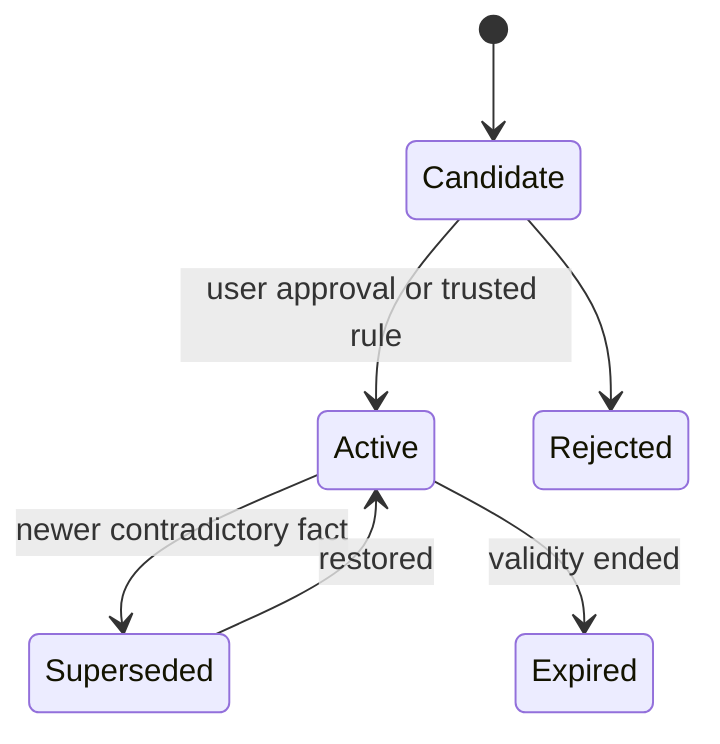

# Data and Memory Model

Mosaic separates four layers: original source data, normalized domain records, retrieval units, and durable memory/insights. Embeddings and generated summaries are never canonical records.

## Core entities

- **Source** — file, app, email, calendar, photo, conversation or manual input, including ownership, classification and metadata.
- **Artifact** — imported document, image, message, workout payload or other versioned source item.
- **Entity** — person, place, organization, food, exercise, device, project or custom concept.
- **Event** — a dated occurrence such as a meal, swim, workout, measurement or document creation.
- **Observation** — a measured, reported, calculated or model-estimated value with unit, method and confidence.
- **Relationship** — a typed link between entities, optionally valid only during a time range.
- **Memory** — a profile fact, preference, goal, constraint, summary or insight with status, confidence and provenance.
- **Evidence** — a resolvable locator into an immutable artifact version, such as page, line, timestamp, record ID or image region.

## Provenance rules

- Every normalized record points to one or more sources.
- Every model-derived field stores the model, prompt/version and confidence.
- User corrections supersede estimates without erasing history.
- Derived insights list the events and observations used.
- Citations resolve to immutable artifact versions.

## Memory lifecycle

## Storage recommendation

Use PostgreSQL for normalized data, provenance, jobs and permissions; pgvector for initial embeddings; local filesystem or an S3-compatible local object store for media; and Redis only when workload coordination requires it. SQLite remains suitable for isolated prototypes and mobile clients.