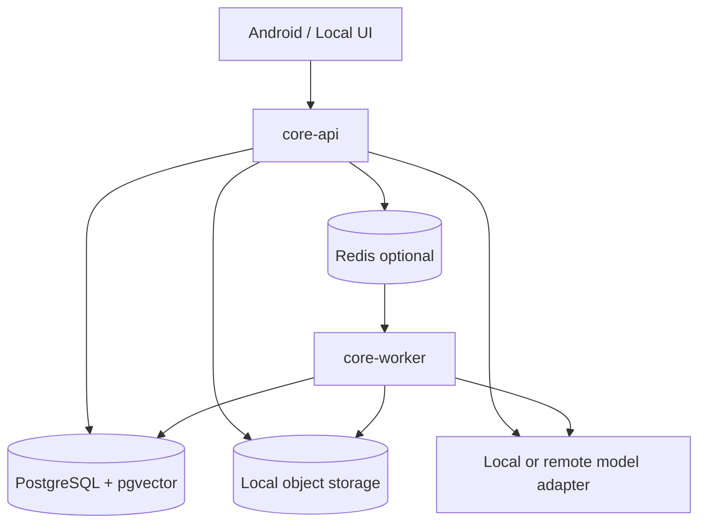

# Deployment Topology

## Runtime roles

### Home computer — primary Mosaic node

Runs the canonical Mosaic Core database, API, retrieval, memory, local file/photo access, vector index, ingestion and local inference when available. The recommended environment is Docker Desktop/WSL2 or dedicated Linux on the Windows 11 desktop with RTX 4070 and 64 GB RAM.

### VPS — optional always-on compute

Runs remote image analysis, scheduled jobs, internet-facing relays and model inference that does not require unrestricted private data. It must not silently become the canonical personal database.

### Android clients

Room remains the offline-first operational store. Clients queue changes, synchronize when Core is reachable and remain usable without the home node.

## Phase 1 topology

## Connectivity

Preferred access order: local network, private mesh VPN such as Tailscale/WireGuard, and authenticated VPS relay only when necessary. Do not expose the home Core API directly to the public internet.

## Availability

Mosaic is eventually consistent. Domain clients work offline, sync resumes after reconnecting, unavailable home-only sources are reported clearly, and remote jobs use scoped encrypted input packages.

## Backup

Back up PostgreSQL, object metadata, configuration and encryption recovery material. Keep at least one encrypted off-device copy and periodically test restoration.