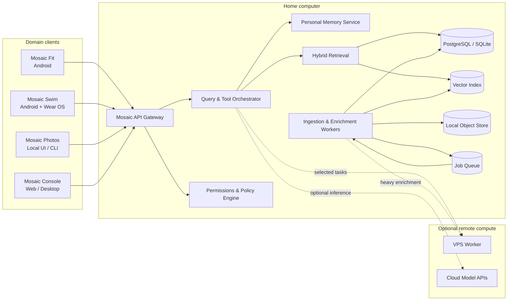

# System Architecture

## 1. Purpose

Mosaic is a personal intelligence platform designed to create a reliable, private and explainable view across the user's information.

It is not a single large application and it is not a foundation model trained from scratch. It is an orchestration and knowledge layer built around:

- domain-owned applications and data;
- structured personal memory;
- document and media indexing;
- retrieval-augmented generation;
- tools and workflows;
- permissions, provenance and citations;
- local-first storage with optional remote compute.

## 2. Architectural principles

1. **Local-first** — canonical personal data is stored on user-controlled devices whenever practical.
2. **Domain ownership** — each domain app owns its operational data and user experience.
3. **Mosaic as integration layer** — Mosaic Core indexes, links and reasons across domains without replacing them.
4. **Evidence before inference** — every derived answer should retain source references and confidence.
5. **Structured memory before prompt stuffing** — stable facts, events, entities and relationships are stored explicitly.
6. **Replaceable models** — model providers and embedding models are adapters, not architectural dependencies.
7. **Asynchronous ingestion** — indexing and enrichment are background jobs, separated from interactive queries.
8. **Least privilege** — connectors and agents receive only the permissions required for the current operation.

## 3. High-level topology

## 4. Core components

### 4.1 API Gateway

A Python/FastAPI service that provides authentication and device identity, versioned REST endpoints, request validation, synchronization idempotency and optional progress streams.

### 4.2 Query and Tool Orchestrator

Classifies requests, builds execution plans, retrieves evidence, calls permitted tools, invokes a selected model, validates and cites results, and writes approved memories.

The orchestrator uses typed service interfaces and the policy engine rather than directly accessing arbitrary storage.

### 4.3 Personal Memory Service

Stores durable profile facts, preferences, constraints, entities, relationships, dated events, goals, observations, summaries and source-backed insights. Every memory includes provenance, confidence, timestamps and visibility scope.

### 4.4 Ingestion and Enrichment Pipeline

1. Receive or discover a source item.
2. Calculate content identity and deduplicate.
3. Extract text and metadata.
4. Normalize into the unified model.
5. Split into retrieval units.
6. Create embeddings.
7. Enrich with entities, labels and relationships.
8. Store provenance and access policy.
9. Publish indexing status.

### 4.5 Hybrid Retrieval

Combines metadata filters, relational queries, full-text search, vector similarity, recency and importance scoring, domain-aware reranking and relationship traversal. Retrieval returns evidence objects with resolvable citations.

### 4.6 Model Gateway

A provider-neutral interface for local models on the home PC, remote models on the VPS, selected cloud APIs, embeddings, rerankers and vision models. Routing considers privacy, latency, capability, availability and cost.

## 5. Domain boundaries

### Mosaic Fit

Owns nutrition capture, meal review, daily macro tracking and the mobile experience. It sends normalized nutrition events to Mosaic Core.

### Mosaic Swim

Owns workout plans, Wear OS recording, session details and swimming-specific analysis. It sends workouts, metrics and summaries to Mosaic Core.

### Mosaic Photos

Owns photo ingestion, face clustering, labels, image embeddings and local photo search. Mosaic Core receives references, entities and searchable metadata rather than duplicating the full media library.

### Mosaic Core

Owns cross-domain identity, unified memory, source registry, permissions, retrieval, orchestration and cross-domain insights.

## 6. Typical query flow

For “Did my nutrition on swimming days affect my evening hunger?” Mosaic authenticates the device, identifies relevant domains, authorizes access, retrieves swim sessions and nutrition records, computes comparable windows, explains the result with uncertainty and citations, and saves a derived insight only when configured or approved.

## 7. Non-goals for Phase 1

- autonomous unrestricted agents;
- replacing all domain databases with one central database;
- training a personal foundation model;
- continuous real-time synchronization for every source;
- a complex multi-user SaaS architecture;
- automatic destructive actions.