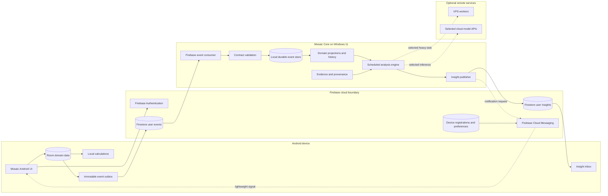

# System Architecture

## 1. Purpose

Mosaic is a local-first personal intelligence platform that creates a reliable, private and explainable view across the user's information.

It is not a single large application and it is not a foundation model trained from scratch. It is a system built around:

- domain-owned applications and local data;
- versioned immutable events;
- asynchronous synchronization through Firebase;
- durable local storage and projections in Mosaic Core;
- scheduled analysis and proactive Insights;
- permissions, provenance and evidence;
- optional remote compute for narrowly defined tasks.

Mosaic Core is primarily an asynchronous personal-intelligence engine. It is not required to be an always-online conversational server.

## 2. Architectural principles

1. **Local-first intelligence** — durable personal history, projections and cross-domain intelligence live on the user-controlled home computer.
2. **Domain ownership** — each domain app owns its operational records and user experience.
3. **Immediate mobile utility** — deterministic daily calculations are performed from local Android data and do not depend on Core availability.
4. **Asynchronous Core** — Core synchronizes, catches up and analyzes when the home computer is available.
5. **Immutable synchronization events** — corrections create new revisions instead of overwriting historical events.
6. **Durable Insights before notifications** — an Insight is stored before any push signal is sent.
7. **Evidence before inference** — every derived Insight retains source references, assumptions and confidence where applicable.
8. **Replaceable infrastructure** — Firebase, model providers and optional VPS workers are adapters with explicit boundaries.
9. **Least privilege and user isolation** — every cloud and local record is user-scoped and access is explicitly authorized.
10. **Notifications are selective** — FCM is a user-controlled signal, not the source of truth and not a delivery guarantee.

## 3. High-level topology



## 4. Component responsibilities

### 4.1 Mosaic Android

Mosaic Android is the operational client and remains useful offline.

It owns:

- Room entities for meals, measurements, workouts, Inventory and other mobile domains;
- local creation, correction and display workflows;
- immediate deterministic calculations such as daily protein totals and remaining target amounts;
- stable aggregate IDs and revisions;
- an immutable, retry-safe event outbox;
- the local Insight inbox and notification preferences.

Android does not need Core to answer simple questions that can be calculated from current local records.

### 4.2 Firebase Authentication

Firebase Authentication provides user identity and a stable `uid` for Android access. It establishes the initial multi-user boundary without making Mosaic Core publicly reachable.

### 4.3 Cloud Firestore event relay

Firestore provides an always-available rendezvous point between Android and Core.

Suggested event path:

```text
users/{uid}/events/{eventId}
```

Its responsibilities are limited to:

- buffering immutable domain events while Core is offline;
- separating user data by authenticated identity;
- supporting mobile offline writes and retry;
- storing limited device and synchronization metadata.

Firestore is not the canonical long-term intelligence database.

### 4.4 Mosaic Core event consumer

The Core consumer runs on the Windows 11 home computer and processes events only for explicitly configured users.

It:

1. reads missing Firebase events;
2. validates event envelopes and payloads against the pinned `mosaic-contracts` submodule;
3. rejects malformed or unsupported versions;
4. deduplicates using stable `eventId` values;
5. stores accepted events locally with owner and source metadata;
6. updates projections and correction history;
7. records consumer checkpoints for efficiency without treating checkpoints as the correctness boundary.

### 4.5 Local event store and projections

The local event store preserves the exact accepted event, ownership, producer device, timestamps and provenance.

Projections provide usable current views while retaining history, for example:

- the latest meal revision;
- earlier meal corrections;
- daily and weekly nutrition totals;
- Inventory-owned stock state;
- swimming sessions and derived training metrics.

Core does not replace the operational Room databases, but it owns the durable cross-domain view.

### 4.6 Scheduled analysis engine

The analysis engine is catch-up safe and runs when Core is available.

Initial cadence:

- on Core startup: synchronize missing events and complete pending work;
- periodically: update projections and lightweight derived metrics;
- weekly: generate summaries, detected patterns and recommendation candidates.

The engine combines structured queries, calculations and optional model inference. It must distinguish stored facts, deterministic calculations and inferred conclusions.

### 4.7 Insight publisher

An Insight is a durable user-scoped result generated by Core.

Suggested path:

```text
users/{uid}/insights/{insightId}
```

An Insight may include:

- type and schema version;
- title and concise summary;
- detailed content;
- severity or notification eligibility;
- evidence references;
- generated time and covered period;
- assumptions and confidence;
- read, dismissed or archived state.

The Insight is written to Firestore before any notification is attempted.

### 4.8 Firebase Cloud Messaging

FCM provides a lightweight signal that a new Insight is available.

The message contains only minimal routing data, such as:

```json
{
  "insightId": "insight-id",
  "destination": "insight-detail"
}
```

FCM must not contain the full sensitive analysis, and notification delivery is not required for correctness. Android synchronizes the Insight inbox independently, so a missed push does not lose the result.

Notification dispatch respects:

- per-category opt-in;
- quiet hours;
- frequency limits;
- device registration state;
- duplicate suppression;
- privacy-safe preview text.

## 5. Domain boundaries

### Mosaic nutrition and fitness domain

Owns meal capture, corrections, daily targets, measurements and the mobile dashboard. Daily totals and remaining targets are calculated locally in Android.

### Mosaic Inventory

Owns products, stock quantities, purchases, expiry dates, conversions and final stock adjustments. Nutrition events may request consumption, but they do not directly mutate Inventory-owned state.

### Mosaic Swim

Owns workout planning, Wear OS recording and swimming-specific operational data. Core may later combine these events with nutrition and measurements to generate weekly Insights.

### Mosaic Photos

Owns local media ingestion, face clustering and photo search. Core receives selected metadata, entities and evidence references rather than duplicating the complete library by default.

### Mosaic Core

Owns accepted cross-domain event history, local projections, provenance, scheduled analysis and proactive Insights. It does not need to serve remote interactive questions continuously.

## 6. Primary data flows

### 6.1 Android-to-Core event flow

```text
User records or corrects data in Android
→ Room transaction updates operational state
→ immutable event is added to the local outbox
→ Android publishes the event to the user's Firestore path
→ Core later downloads and validates the event
→ Core stores it idempotently
→ projections and history are updated
```

### 6.2 Immediate local calculation flow

```text
User opens the daily dashboard
→ Android queries Room
→ deterministic totals are calculated locally
→ current protein, calories and remaining targets are displayed immediately
```

This flow works without Firebase connectivity and while the home computer is off.

### 6.3 Passive Insight flow

```text
Core starts or reaches a scheduled analysis window
→ missing events are synchronized
→ projections are updated
→ evidence-backed weekly analysis runs
→ a durable Insight is written to Firestore
→ eligible Insight triggers an FCM signal
→ Android receives or later synchronizes the Insight
→ the user opens the full Insight from the inbox
```

## 7. Example first useful outcome

Android immediately displays:

> 108 g protein recorded today; 22 g remain to reach the configured target.

After a weekly Core run, Mosaic may publish:

> You reached your protein target on 5 of 7 days. Both missed days followed swimming sessions, and most of the shortfall occurred at dinner.

The weekly Insight links to the exact meal and workout records used. The user can receive a notification that the summary is ready, but the summary remains available even if the notification is never delivered.

## 8. Multiple users and households

Every cloud event, Insight, device registration and local accepted event carries an owner identity.

The first installation may support one configured Firebase user, but the architecture must avoid global unscoped collections. A later household Core may process several authorized users while preserving:

- separate permissions;
- separate notification preferences;
- user-specific evidence and Insights;
- explicit rules for shared household domains such as Inventory.

## 9. Optional interactive access

Interactive question answering is deferred and optional.

Possible future modes include:

- local questions while the user is on the home network and Core is available;
- a limited cloud service for approved question types;
- on-device natural-language interpretation backed by local Room calculations.

None of these are required for the first useful Mosaic experience.

## 10. Non-goals for the first passive slice

- exposing Mosaic Core as a public internet server;
- requiring the phone and home computer to be online simultaneously;
- using FCM as persistent storage or a guaranteed queue;
- storing the entire personal-intelligence database in Firestore;
- unrestricted autonomous agents;
- fully automatic destructive actions;
- automatic stock deduction from uncertain meal estimates;
- complex multi-tenant SaaS administration;
- real-time model-backed conversation from every location.
