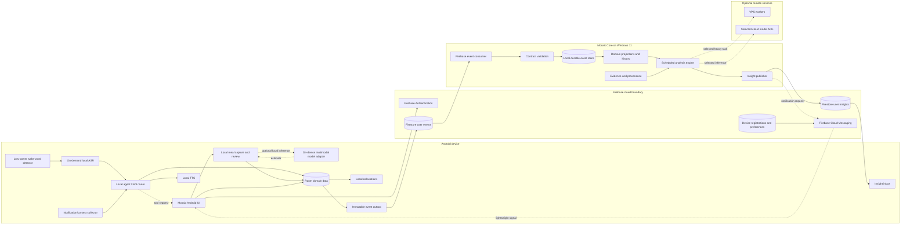

# System Architecture

## 1. Purpose

Mosaic is a local-first personal intelligence platform that creates a reliable, private and explainable view across the user's information.

It is not a single large application and it is not a foundation model trained from scratch. It is a system built around:

- domain-owned applications and local data;
- immediate mobile workflows that remain useful offline;
- optional on-device model assistance for latency-sensitive capture tasks;
- an on-device voice-agent loop with low-power wake-word activation, on-demand ASR, tool use and TTS;
- permission-scoped local context collectors such as Android notifications;
- versioned immutable events;
- asynchronous synchronization through Firebase;
- durable local storage and projections in Mosaic Core;
- scheduled analysis and proactive Insights;
- permissions, provenance and evidence;
- optional remote compute for narrowly defined tasks.

Mosaic Core is primarily an asynchronous personal-intelligence engine. It is not required to be an always-online conversational server or an always-available meal-analysis endpoint.

## 2. Architectural principles

1. **Local-first intelligence** — durable personal history, projections and cross-domain intelligence live on the user-controlled home computer.
2. **Domain ownership** — each domain app owns its operational records and user experience.
3. **Immediate mobile utility** — recording, correction and deterministic daily calculations are performed from local Android data and do not depend on Core availability.
4. **On-device assistance for immediate capture** — when model assistance is useful for a latency-sensitive mobile workflow such as meal-photo analysis, the preferred production path is a replaceable on-device adapter on capable hardware.
5. **Asynchronous Core** — Core synchronizes, catches up and performs deeper historical analysis when the home computer is available.
6. **Immutable synchronization events** — corrections create new revisions instead of overwriting historical events.
7. **Durable Insights before notifications** — an Insight is stored before any push signal is sent.
8. **Evidence before inference** — every derived Insight retains source references, assumptions and confidence where applicable.
9. **Replaceable infrastructure** — Firebase, model runtimes, model providers and optional VPS workers are adapters with explicit boundaries.
10. **Least privilege and user isolation** — every cloud and local record is user-scoped and access is explicitly authorized.
11. **Notifications are selective** — FCM is a user-controlled signal, not the source of truth and not a delivery guarantee.
12. **Always-available does not mean always-running LLM** — a tiny wake-word component may remain active, while ASR, the agent model, vision and TTS run only when needed.
13. **Permission-scoped local agency** — notification access, microphone access and Android actions are explicit capabilities. Reading local context does not automatically authorize sending, deleting, purchasing or other externally visible/destructive actions.

## 3. High-level topology


```mermaid
flowchart LR
    subgraph Mobile[Android device]
        UI[Mosaic Android UI]
        Wake[Low-power wake-word detector]
        ASR[On-demand local ASR]
        Agent[Local agent / tool router]
        TTS[Local TTS]
        Notify[Notification/context collector]
        Capture[Local meal capture and review]
        LocalModel[On-device multimodal model adapter]
        Room[(Room domain data)]
        Calc[Local calculations]
        Outbox[Immutable event outbox]
        Inbox[Insight inbox]
    end

    subgraph Firebase[Firebase cloud boundary]
        Auth[Firebase Authentication]
        Events[(Firestore user events)]
        Insights[(Firestore user Insights)]
        Devices[(Device registrations and preferences)]
        FCM[Firebase Cloud Messaging]
    end

    subgraph Home[Mosaic Core on Windows 11]
        Consumer[Firebase event consumer]
        Validator[Contract validation]
        EventStore[(Local durable event store)]
        Projection[Domain projections and history]
        Analysis[Scheduled analysis engine]
        Evidence[Evidence and provenance]
        Publisher[Insight publisher]
    end

    subgraph Optional[Optional remote services]
        VPS[VPS workers]
        CloudModels[Selected cloud model APIs]
    end

    Wake --> ASR
    ASR --> Agent
    Agent --> TTS
    Notify --> Agent
    Agent --> Room
    Agent -. tool request .-> UI
    UI --> Capture
    Capture --> Room
    Capture -. optional local inference .-> LocalModel
    LocalModel -. estimate .-> Capture
    UI --> Room
    Room --> Calc
    Room --> Outbox
    UI --> Auth
    Outbox --> Events

    Events --> Consumer
    Consumer --> Validator
    Validator --> EventStore
    EventStore --> Projection
    Projection --> Analysis
    Evidence --> Analysis
    Analysis --> Publisher
    Publisher --> Insights

    Insights --> Inbox
    Publisher -. notification request .-> FCM
    Devices --> FCM
    FCM -. lightweight signal .-> UI

    Analysis -. selected inference .-> CloudModels
    Analysis -. selected heavy task .-> VPS
```

The mobile model adapter is deliberately separate from Core analysis. A future Android runtime may change without changing canonical contracts, Room ownership or the capture/review flow.

The local assistant path is also separate from the asynchronous Core path. Wake-word detection is intentionally lightweight; detecting "Mosaic" activates the heavier ASR → agent → tool → TTS pipeline only for the duration of the interaction. The Windows Core is not required for this loop.

## 4. Component responsibilities

### 4.1 Mosaic Android

Mosaic Android is the operational client and remains useful offline.

It owns:

- Room entities for meals, measurements, workouts, Inventory and other mobile domains;
- local creation, correction and display workflows;
- manual meal capture that never requires network connectivity;
- immediate deterministic calculations such as daily protein/calorie totals and remaining target amounts;
- configurable local daily goals;
- the review and confirmation step that turns an estimate into a trusted operational record;
- stable aggregate IDs and revisions;
- an immutable, retry-safe event outbox;
- the local Insight inbox and notification preferences.

Android does not need Core to answer simple questions that can be calculated from current local records.

#### Local voice-agent boundary

The intended local assistant flow is:

```text
low-power wake-word detector
  → explicit "Mosaic" activation
  → on-demand local ASR
  → local agent reasoning / tool selection
  → permission-scoped Android tools and local retrieval
  → local TTS response
```

The LLM is not kept continuously active. The wake-word component should be independently replaceable and optimized for low memory, thermal and battery cost.

Initial local tools may include:

- query recent Room-backed domain records;
- query explicitly authorized Android notification history/context;
- search locally indexed photos and metadata;
- read selected notification/message text aloud through TTS;
- open the relevant application or Mosaic screen.

Actions that create external side effects, including sending a message, deleting data, making purchases or changing protected settings, must pass an explicit action policy and require confirmation when appropriate.

Android platform integration should prefer supported assistant/background APIs. If Mosaic is configured as the device's assistant, Android's voice-interaction facilities are preferred over an unrestricted always-running microphone service.

#### Meal-analysis adapter boundary

Photo-assisted meal analysis is an optional Android capability behind a replaceable application boundary:

```text
MealPhotoInput → MealAnalyzer → MealAnalysis estimate
```

The intended production behavior is:

- prefer an on-device analyzer on capable hardware;
- retain a remote/HTTP analyzer only as a development tool or explicitly selected fallback;
- keep model/runtime details out of the capture UI and canonical meal contract;
- retain assumptions, confidence and original estimated values when available;
- require user review/confirmation before an estimate becomes trusted meal data;
- keep immediate capture working while Core is off.

The exact on-device runtime and model are selected only after benchmarking representative target hardware for accuracy, memory use, latency, thermal behavior and battery impact.

### 4.2 Firebase Authentication

Firebase Authentication provides user identity and a stable `uid` for Android access. It establishes the initial multi-user boundary without making Mosaic Core publicly reachable.

### 4.3 Cloud Firestore event relay

Firestore provides an always-available rendezvous point between Android and Core.

Suggested event path:

```text
users/{uid}/events/{eventId}
```

Its responsibilities are limited to:

- buffering immutable domain events while Core is offline;
- separating user data by authenticated identity;
- supporting mobile offline writes and retry;
- storing limited device and synchronization metadata.

Firestore is not the canonical long-term intelligence database and is not the default transport for meal photos or unconfirmed analysis estimates.

### 4.4 Mosaic Core event consumer

The Core consumer runs on the Windows 11 home computer and processes events only for explicitly configured users.

It:

1. reads missing Firebase events;
2. validates event envelopes and payloads against the pinned `mosaic-contracts` submodule;
3. rejects malformed or unsupported versions;
4. deduplicates using stable `eventId` values;
5. stores accepted events locally with owner and source metadata;
6. updates projections and correction history;
7. records consumer checkpoints for efficiency without treating checkpoints as the correctness boundary.

### 4.5 Local event store and projections

The local event store preserves the exact accepted event, ownership, producer device, timestamps and provenance.

Projections provide usable current views while retaining history, for example:

- the latest meal revision;
- earlier meal corrections;
- daily and weekly nutrition totals;
- Inventory-owned stock state;
- swimming sessions and derived training metrics.

Core does not replace the operational Room databases, but it owns the durable cross-domain view.

### 4.6 Scheduled analysis engine

The analysis engine is catch-up safe and runs when Core is available.

Initial cadence:

- on Core startup: synchronize missing events and complete pending work;
- periodically: update projections and lightweight derived metrics;
- weekly: generate summaries, detected patterns and recommendation candidates.

The engine combines structured queries, calculations and optional model inference. It must distinguish stored facts, deterministic calculations and inferred conclusions.

Immediate meal-photo analysis is not a scheduled Core responsibility; it belongs to the Android capture experience when supported locally.

### 4.7 Insight publisher

An Insight is a durable user-scoped result generated by Core.

Suggested path:

```text
users/{uid}/insights/{insightId}
```

An Insight may include:

- type and schema version;
- title and concise summary;
- detailed content;
- severity or notification eligibility;
- evidence references;
- generated time and covered period;
- assumptions and confidence;
- read, dismissed or archived state.

The Insight is written to Firestore before any notification is attempted.

### 4.8 Firebase Cloud Messaging

FCM provides a lightweight signal that a new Insight is available.

The message contains only minimal routing data, such as:

```json
{
  "insightId": "insight-id",
  "destination": "insight-detail"
}
```

FCM must not contain the full sensitive analysis, and notification delivery is not required for correctness. Android synchronizes the Insight inbox independently, so a missed push does not lose the result.

Notification dispatch respects:

- per-category opt-in;
- quiet hours;
- frequency limits;
- device registration state;
- duplicate suppression;
- privacy-safe preview text.

## 5. Domain boundaries

### Mosaic nutrition and fitness domain

Owns manual and assisted meal capture, corrections, daily targets, measurements and the mobile dashboard. Daily totals and remaining targets are calculated locally in Android.

Model-generated meal values are suggestions until the user confirms them. Confirmed meal data, not raw model output, is the business record that enters the normal synchronization path.

### Mosaic Inventory

Owns products, stock quantities, purchases, expiry dates, conversions and final stock adjustments. Nutrition events may request consumption, but they do not directly mutate Inventory-owned state.

### Mosaic Swim

Owns workout planning, Wear OS recording and swimming-specific operational data. Core may later combine these events with nutrition and measurements to generate weekly Insights.

### Mosaic Photos

Owns local media ingestion, face clustering and photo search. Core receives selected metadata, entities and evidence references rather than duplicating the complete library by default.

### Mosaic Core

Owns accepted cross-domain event history, local projections, provenance, scheduled analysis and proactive Insights. It does not need to serve remote interactive questions continuously or be reachable when the user records a meal.

## 6. Primary data flows

### 6.1 Android-to-Core event flow

```text
User records or corrects confirmed data in Android
→ Room transaction updates operational state
→ immutable event is added to the local outbox
→ Android publishes the event to the user's Firestore path
→ Core later downloads and validates the event
→ Core stores it idempotently
→ projections and history are updated
```

### 6.2 Immediate local calculation flow

```text
User opens the daily dashboard
→ Android queries Room
→ deterministic totals are calculated locally
→ current protein, calories and remaining targets are displayed immediately
```

This flow works without Firebase connectivity and while the home computer is off.

### 6.3 Local meal-capture flow

Manual path:

```text
User enters meal details
→ Android validates local fields
→ confirmed meal is saved to Room
→ daily totals and goal progress update immediately
```

Assisted path on a capable device:

```text
User captures a meal photo
→ Android reads the photo into MealPhotoInput
→ MealAnalyzer runs through the selected on-device adapter
→ an estimate with confidence/assumptions is shown
→ user confirms or corrects it
→ confirmed meal is saved to Room
→ daily totals and goal progress update immediately
```

Neither path requires Mosaic Core to be online.

### 6.4 Local voice interaction flow

```text
User says "Mosaic"
→ low-power wake-word detector activates the interaction
→ local ASR transcribes the request
→ local agent selects retrieval/tools
→ Android executes only permitted tool calls
→ local agent prepares the answer
→ TTS speaks the response
→ heavy inference components return to idle
```

Example:

```text
"Mosaic, read the latest message from my wife"
→ query authorized recent notifications
→ select matching notification
→ speak its text locally
```

Notification-derived message content is local context by default and is not uploaded to Firebase/Core merely because it was read by the assistant.

### 6.5 Passive Insight flow

```text
Core starts or reaches a scheduled analysis window
→ missing events are synchronized
→ projections are updated
→ evidence-backed weekly analysis runs
→ a durable Insight is written to Firestore
→ eligible Insight triggers an FCM signal
→ Android receives or later synchronizes the Insight
→ the user opens the full Insight from the inbox
```

## 7. Example first useful outcome

Android immediately displays:

> 108 g protein recorded today; 22 g remain to reach the configured target.

The user may have entered the meal manually or confirmed an on-device estimate; the daily result is deterministic either way because it is calculated from confirmed Room records.

After a weekly Core run, Mosaic may publish:

> You reached your protein target on 5 of 7 days. Both missed days followed swimming sessions, and most of the shortfall occurred at dinner.

The weekly Insight links to the exact meal and workout records used. The user can receive a notification that the summary is ready, but the summary remains available even if the notification is never delivered.

## 8. Multiple users and households

Every cloud event, Insight, device registration and local accepted event carries an owner identity.

The first installation may support one configured Firebase user, but the architecture must avoid global unscoped collections. A later household Core may process several authorized users while preserving:

- separate permissions;
- separate notification preferences;
- user-specific evidence and Insights;
- explicit rules for shared household domains such as Inventory.

## 9. Interactive access

On-device interactive access is an intended Android capability and does not require Core reachability.

The preferred direction is a local assistant that can be activated by an explicit wake word, interpret Hebrew speech locally, use permission-scoped tools over local context and answer through TTS. This capability should remain useful while the home computer and Firebase are unavailable.

Interactive access to the deeper Windows Core remains optional and deferred. It may later provide historical or compute-heavy answers when Core is reachable, but the Android assistant must not depend on it for ordinary local actions.

## 10. Non-goals for the first passive slice

- exposing Mosaic Core as a public internet server;
- requiring the phone and home computer to be online simultaneously;
- requiring direct HTTP access to the home Core for meal recording or meal-photo analysis;
- using FCM as persistent storage or a guaranteed queue;
- storing the entire personal-intelligence database in Firestore;
- uploading meal photos to Firebase by default;
- treating model estimates as trusted nutrition facts before confirmation;
- unrestricted autonomous agents;
- keeping a general-purpose LLM continuously active only to detect the wake word;
- covert or permission-bypassing microphone/notification collection;
- fully automatic destructive actions;
- automatic stock deduction from uncertain meal estimates;
- complex multi-tenant SaaS administration;
- real-time model-backed conversation from every location.
